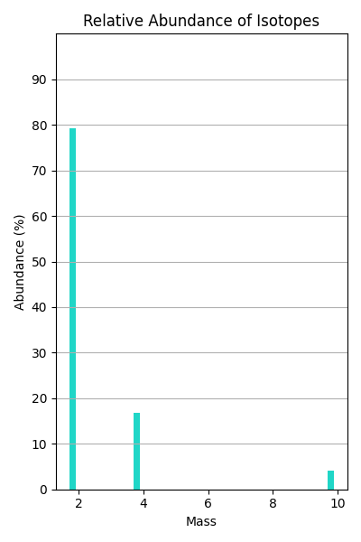

# cham-graph
### A python script that will create a diagram showing the relative abundance of a isotopes in a sample.
****

<p align="center">
  
</p>

### Requirements

* [Python 3.8+](https://www.python.org/downloads/)

**Python packages**

* [Matplotlib](https://matplotlib.org/) (`pip install matplotlib`)


### How to make your own graph
In line 6 and 7, you can find following lists.
```python
mass = [2, 4, 6, 8, 10]
abundance = [79.2, 16.7, 0, 0, 4.2]
```
The first list is the mass of the isotope, and the second list is the relative abundance of the isotope. The lists must be the same length. The lists are used to create the graph.
For example, if you want to make a graph of the isotopes of carbon, you would change the lists to the following.
```python
mass = [12, 13]
abundance = [98.9, 1.1]
```
After you have changed the lists, you can run `main.py` to create the graph.